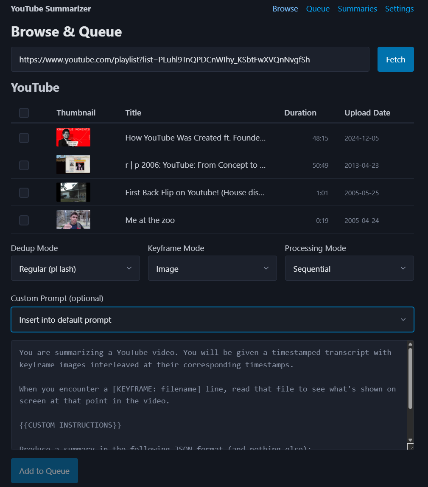
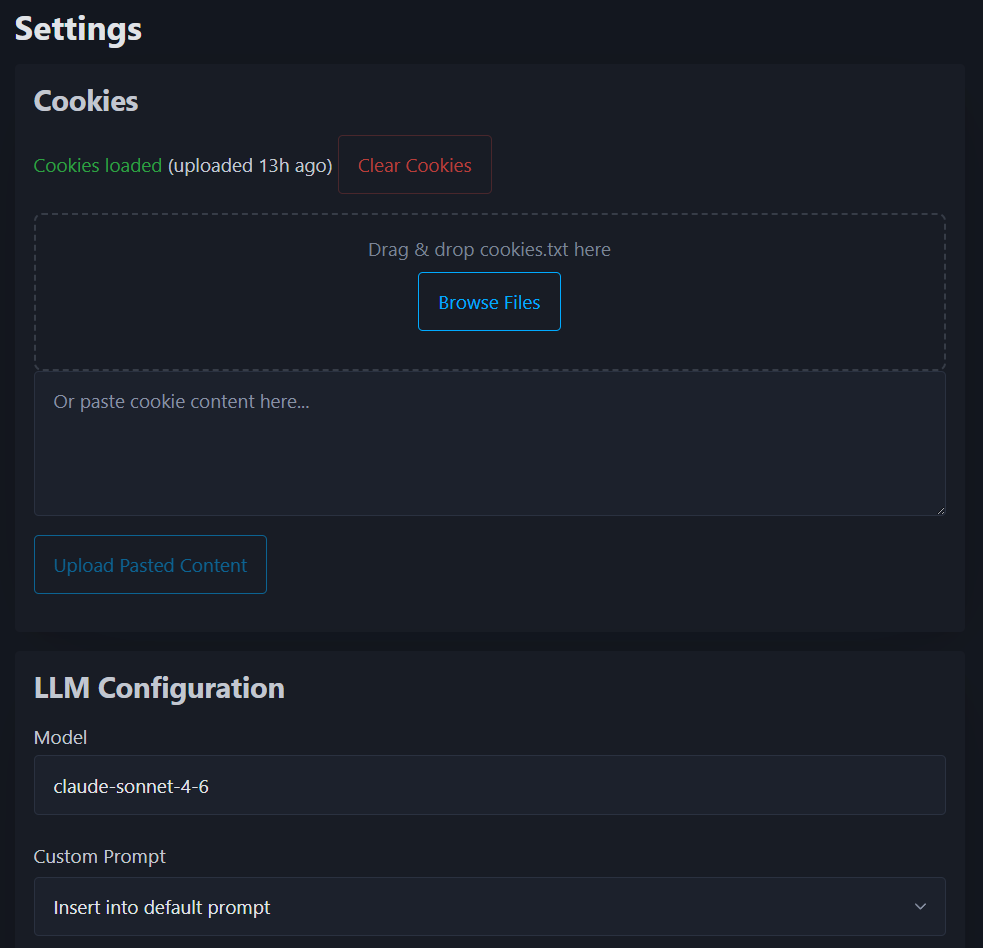
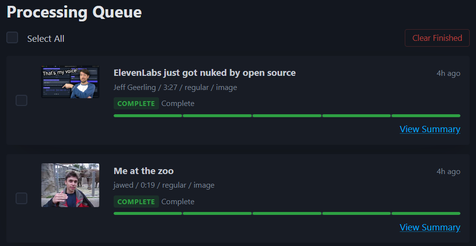
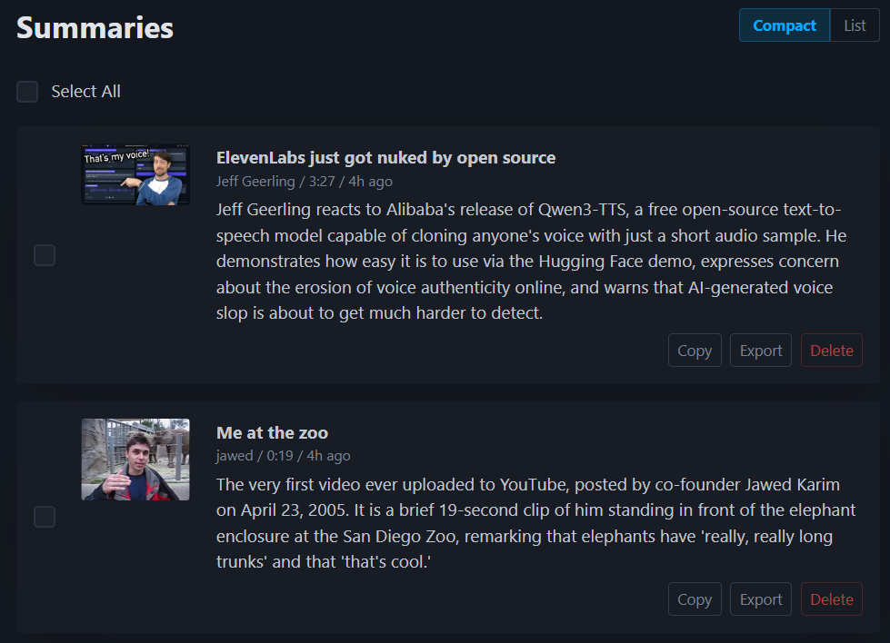

# YouTube Video Summarizer 


Self-hosted web app that summarizes YouTube videos using keyframe extraction, OCR, transcript analysis, and Claude AI. Supports members-only videos with cookie authentication.

> [!WARNING]
> This project is mostly generated by AI. Readability, maintainability, and correctness are not guaranteed.

## Screenshots

| Browse | Settings |
|--------|----------|
|  |  |

| Queue | Summaries |
|-------|-----------|
|  |  |

## Features

- Full web UI with 5 tabs: Browse, Queue, Summaries, Settings, Help
- YouTube video, channel, and playlist browsing with visibility filters
- Multi-video queue with sequential and batch processing modes
- GPU-accelerated pipeline: download, transcript, keyframes, dedup, OCR, summarize
- 4 keyframe dedup modes: regular (pHash), slides (SSIM), ocr (fuzzy text match), none
- 6 keyframe modes for LLM summarization: image, ocr, ocr+image, ocr-inline, ocr-inline+image, none
- Claude AI summarization via Agent SDK (OAuth auth, no API key needed)
- Members-only video support via cookie authentication
- Output language control (per-job, global default, or auto-detect from transcript)
- Rerun failed or cancelled jobs from the queue
- Custom prompts with insert/replace modes
- Markdown rendering in summaries (tables, lists, headings via marked.js + DOMPurify)
- CLI for quick single-video summarization
- Whisper fallback for videos without captions (auto language detection, multilingual)
- Detected language shown in queue with translation indicator (e.g. `ja → en`)
- Dark theme by default (Pico CSS)

## Requirements

- Python 3.14+
- [uv](https://docs.astral.sh/uv/) (Python package manager)
- [Node.js](https://nodejs.org/) 18+ (via nvm -- needed by yt-dlp for YouTube)
- [ffmpeg](https://ffmpeg.org/)
- [Claude Code](https://code.claude.com/docs/en/overview) (for LLM summarization)
- GPU (recommended for `faster-whisper` and `Chandra OCR`)

## Install

```bash
# Clone the repo
git clone git@github.com:StevenGuo42/youtube-summarizer.git
cd youtube-summarizer

# Install Python dependencies
uv sync

# Install Node.js via nvm (if not already installed)
curl -o- https://raw.githubusercontent.com/nvm-sh/nvm/v0.40.0/install.sh | bash
nvm install --lts

# Install ffmpeg (Debian/Ubuntu)
sudo apt install ffmpeg

# Authenticate with Claude
claude auth login
```

## Usage

### Web App

```bash
uv run uvicorn app.main:app --host 0.0.0.0 --port 8000 --reload
```

Open `http://localhost:8000` in your browser. The web app has 5 tabs:

- **Browse** -- Search channels, browse playlists, filter by visibility, select videos to queue
- **Queue** -- View job progress through pipeline steps, cancel or delete jobs, batch operations
- **Summaries** -- View completed summaries with structured output, export as markdown, delete
- **Settings** -- Configure LLM model and custom prompts, manage cookies, adjust worker settings, set default dedup and keyframe context modes
- **Help** -- Quick reference for keyframe modes, dedup modes, and pipeline steps

<details>
<summary><strong>CLI</strong></summary>

```bash
# Summarize a public video
uv run python cli.py "https://www.youtube.com/watch?v=VIDEO_ID"

# Without keyframes (faster)
uv run python cli.py "https://www.youtube.com/watch?v=VIDEO_ID" --no-keyframes

# With OCR (extract text from keyframes for Claude)
uv run python cli.py "https://www.youtube.com/watch?v=VIDEO_ID" --ocr inline

# OCR only, no images (cheaper, less tokens)
uv run python cli.py "https://www.youtube.com/watch?v=VIDEO_ID" --no-keyframes --ocr inline

# Slides mode dedup (keeps more keyframes for presentations)
uv run python cli.py "https://www.youtube.com/watch?v=VIDEO_ID" --dedup slides

# Save to file
uv run python cli.py "https://www.youtube.com/watch?v=VIDEO_ID" -o summary.md

# Extract transcript only (no Claude needed)
uv run python cli.py "https://www.youtube.com/watch?v=VIDEO_ID" --transcript-only

# Custom prompt
uv run python cli.py "https://www.youtube.com/watch?v=VIDEO_ID" \
  --prompt "Summarize in bullet points, return in 中文. Return JSON with title, tldr, summary keys."

# JSON output
uv run python cli.py "https://www.youtube.com/watch?v=VIDEO_ID" --no-keyframes --format json
```

See [docs/cli.md](docs/cli.md) for all options.

</details>

## Members-Only Videos

Members-only videos require YouTube cookies. Export from your local browser and upload:

```bash
# On your local machine (requires yt-dlp installed locally)
yt-dlp --cookies-from-browser chrome --cookies cookies.txt "https://youtube.com" --skip-download

# Upload to the server
scp cookies.txt user@server:~/code/youtube-summarizer/data/cookies.txt
```

Then use as normal:

```bash
uv run python cli.py "https://www.youtube.com/watch?v=VIDEO_ID" --cookies data/cookies.txt
```

Cookies can also be uploaded via the Settings tab in the web UI. They expire every ~2 weeks -- re-export when you get auth errors.

## How It Works

1. **Download** -- yt-dlp downloads the video with cookie auth and JS runtime for YouTube challenges
2. **Transcript** -- YouTube captions extracted first; falls back to faster-whisper on GPU with auto language detection
3. **Keyframes** -- ffmpeg scene detection extracts key visual moments; uniform interval fallback for static videos; PNG output downscaled via Pillow
4. **Dedup** -- Similar keyframes collapsed using one of 4 modes: regular (pHash hamming distance), slides (SSIM for presentations), ocr (fuzzy text match), or none
5. **OCR** (optional) -- chandra-ocr-2 extracts on-screen text from deduplicated keyframes (4-bit quantized, ~2.5 GB VRAM)
6. **Summarize** -- Transcript grouped by keyframe timestamp ranges with XML tags, sent to Claude via Agent SDK with images and/or OCR text
7. **Cleanup** -- Temp files removed, summary saved to SQLite

<details>
<summary><strong>API Endpoints</strong></summary>

### Auth

| Endpoint | Description |
|----------|-------------|
| `POST /api/auth/cookies` | Upload cookies.txt file |
| `DELETE /api/auth/cookies` | Remove stored cookies |
| `GET /api/auth/status` | Check cookie validity |

### Browse

| Endpoint | Description |
|----------|-------------|
| `GET /api/channel/search?q=<query>` | Search channels by name |
| `GET /api/channel/{id}/videos` | List videos for a channel (supports filters: members_only, pagination) |
| `GET /api/playlist/{id}/videos` | List videos in a playlist |
| `POST /api/video/dates` | Get upload dates for a batch of video IDs |
| `GET /api/video/info?url=<url>` | Get metadata for a single video URL |

### Queue

| Endpoint | Description |
|----------|-------------|
| `POST /api/queue` | Add videos to processing queue |
| `GET /api/queue` | List all jobs |
| `DELETE /api/queue` | Bulk delete specific jobs by ID |
| `DELETE /api/queue/finished` | Clear all finished jobs (done/failed/cancelled) |
| `GET /api/queue/{id}` | Get single job status |
| `DELETE /api/queue/{id}` | Cancel a pending/processing job |
| `POST /api/queue/{id}/rerun` | Rerun a failed or cancelled job |

### Summaries

| Endpoint | Description |
|----------|-------------|
| `GET /api/summaries` | List completed summaries |
| `GET /api/summaries/{id}` | Get full summary |
| `DELETE /api/summaries/{id}` | Delete a summary |
| `GET /api/summaries/{id}/export` | Export summary as markdown |

### Settings

| Endpoint | Description |
|----------|-------------|
| `GET /api/settings/auth/claude` | Check Claude auth status |
| `GET /api/settings/llm` | Get LLM configuration |
| `POST /api/settings/llm` | Save LLM configuration |
| `GET /api/settings/worker` | Get worker settings (processing mode, batch size) |
| `POST /api/settings/worker` | Save worker settings |
| `GET /api/settings/defaults` | Get default dedup/keyframe modes for new jobs |
| `POST /api/settings/defaults` | Save default dedup/keyframe modes |

</details>

<details>
<summary><strong>Running Tests</strong></summary>

```bash
uv run pytest                              # All tests
uv run pytest tests/test_llm.py -k "not test_summarize"  # Unit tests only (no network)
uv run pytest tests/test_pipeline.py       # Full pipeline test
```

Members-only tests require `tests/test_config.json` (copy from `tests/test_config.example.json` and fill in your video ID).

</details>

## Project Structure

```
youtube-summarizer/
├── cli.py                  # CLI entry point
├── app/
│   ├── main.py             # FastAPI app + lifecycle
│   ├── config.py           # Paths, constants, nvm setup
│   ├── database.py         # SQLite schema + access
│   ├── settings.py         # JSON-based settings (LLM, worker)
│   ├── shutdown.py         # Graceful shutdown + GPU cleanup
│   ├── routers/            # API endpoints
│   │   ├── auth.py         # Cookie upload/status
│   │   ├── browse.py       # Channel/playlist/video browsing
│   │   ├── queue.py        # Job queue management
│   │   ├── summaries.py    # Summary retrieval/export
│   │   └── settings.py     # LLM + worker config, auth status
│   ├── services/
│   │   ├── ytdlp.py        # yt-dlp wrapper
│   │   ├── transcript.py   # Captions + Whisper fallback
│   │   ├── keyframes.py    # ffmpeg keyframe extraction + dedup
│   │   ├── ocr.py          # chandra-ocr-2 text extraction
│   │   ├── llm.py          # Claude Agent SDK integration
│   │   └── pipeline.py     # Orchestrates the full pipeline
│   ├── queue/
│   │   └── worker.py       # Async task queue
│   └── static/             # Single-page app (HTML + JS + CSS)
│       ├── index.html
│       ├── app.js
│       └── style.css
├── data/                   # SQLite DB, cookies, temp files
├── docs/                   # CLI docs, module design docs
└── tests/                  # pytest test suite
```

## TODO

- Support more LLM providers (OpenAI, Gemini, local models via Ollama)
